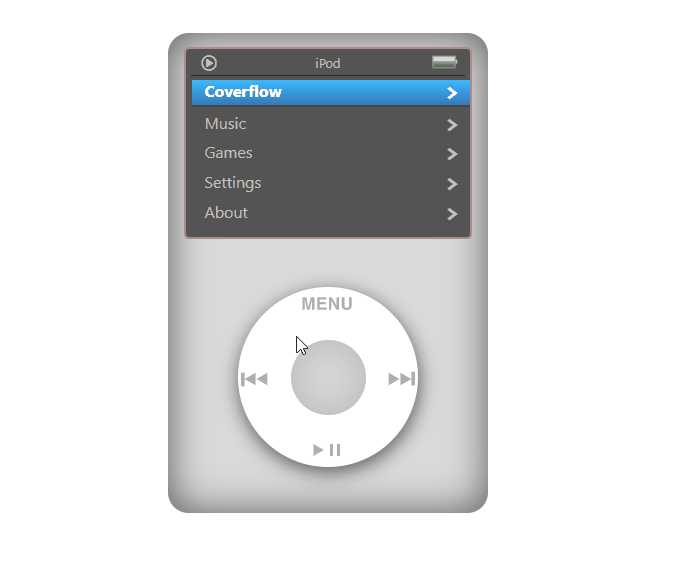

# ipod-classic

This project is web UI of iPod Classic, build using below tech.

> ReactJS , HTML CSS.

> iPod Classic wheel movement is captured using 'zingTouch'.
> mp3 player interface / functionality is implemented using 'react-player'

## Demo

### Demo Hosted at

Check out live demo [here](https://akandhari.github.io/ipod-classic/)

## Available Scripts

In the project directory, you can run:

### `npm start`

Runs the app in the development mode. 
Open [http://localhost:3000](http://localhost:3000) to view it in the browser.

The page will reload if you make edits. 
You will also see any lint errors in the console.

### `npm test`

Launches the test runner in the interactive watch mode. 
See the section about [running tests](https://facebook.github.io/create-react-app/docs/running-tests) for more information.

### `npm run build`

Builds the app for production to the `build` folder. 
It correctly bundles React in production mode and optimizes the build for the best performance.
